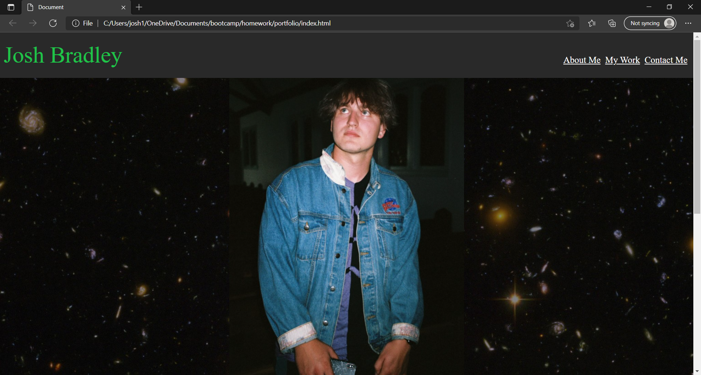

## portfolio

# homework 02

# screenshots

 

# link

[My Portfolio](https://gho5ts.github.io/Portfolio/)

# description

I made a portfolio that has links to different parts of the page and also links that bring you to browsers I've worked on. 